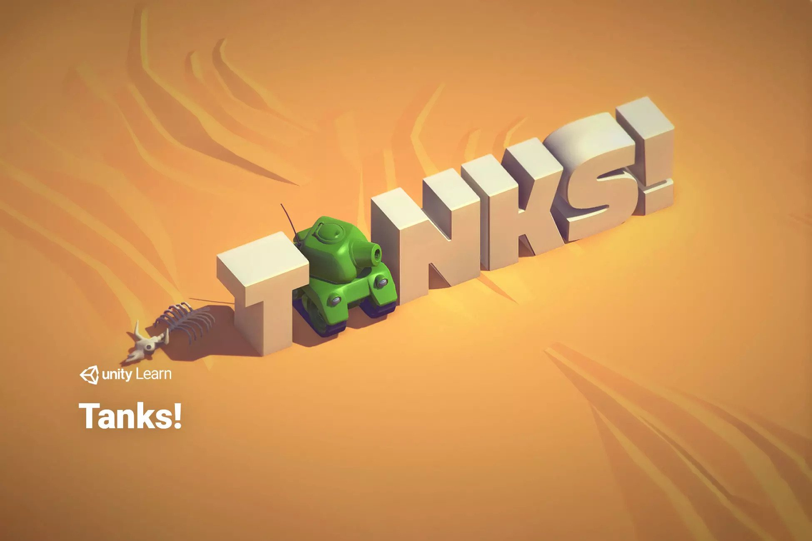

# Tanks Game

3D Tanks Game is a 2 player shooter game using one keyboard that uses simple game mechanics, integrating world and screen space UI, as well as game architecture and audio mixing...

It was implemented following [Tanks Tutorial](https://learn.unity.com/project/tanks-tutorial) on Unity Learn Platform, it was originally recorded at Unite Boston 2015.

## Images 

 
  
 
  
 
  

## Contributors

- Manav Aggarwal
- Raghav Khullar
- Swati Parida

## Resourse

- Unity Learn